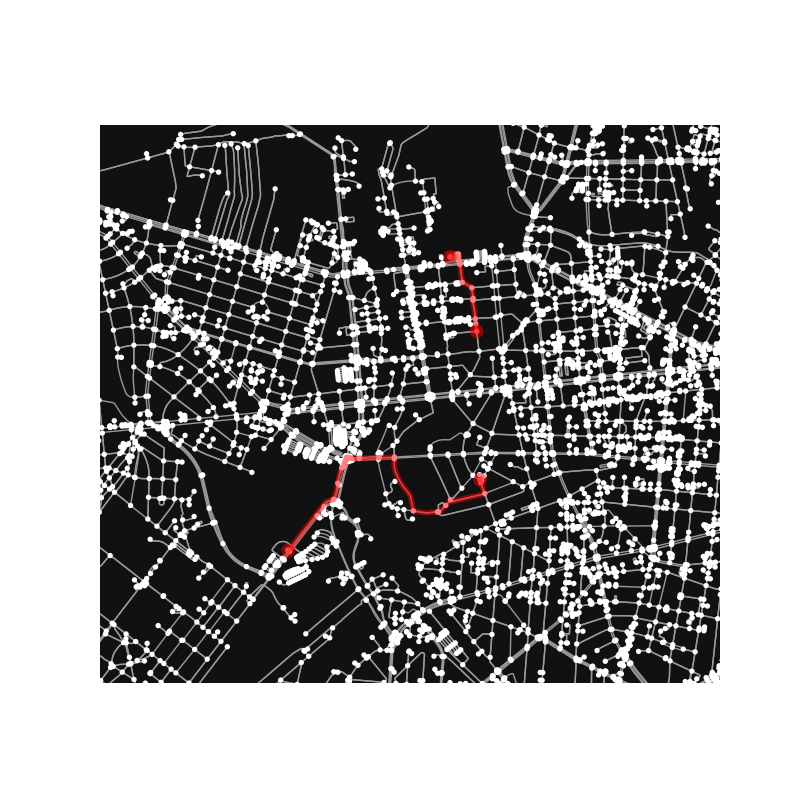

# E-Scooter Trip Generator

Generates synthetic e-scooter trip data for Berlin using OpenStreetMap networks.
It can be configured to generate dataset using other or multiple cities.

**This project has been developed as a part of my [bachelor thesis](https://github.com/erykksc/bachelor-thesis)**



## Usage

### Trips generation

```bash
nix develop
uv run python dataset-generator.py
```

By default outputs CSV with timestamped position events for 1 billion trips into `output/` directory.

### Extract Data

This tool also allows to extract points of interest and administrative boundries.

```bash
nix develop
uv run python extract-pois-locality.py
```

### Distribution visualisations

The scripts in `distribution_visualizations/` allow to visualize the distributions used to model the speed, trip lengths...
